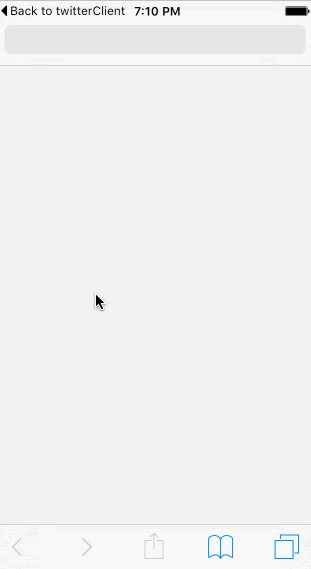

# Assignment 3 - *TwitterClient*

**Twitter** is a basic twitter app to read and compose tweets from the [Twitter API](https://apps.twitter.com/).

Time spent: **27** hours in total

## User Stories

**required** features:

- [X] User can sign in using OAuth login flow.
- [X] User can view last 20 tweets from their home timeline.
- [X] The current signed in user will be persisted across restarts.
- [X] In the home timeline, user can view tweet with the user profile picture, username, tweet text, and timestamp.  In other words, design the custom cell with the proper Auto Layout settings.  You will also need to augment the model classes.
- [X] User can pull to refresh.
- [X] User can compose a new tweet by tapping on a compose button.

**optional** features:

- [X] When composing, you should have a countdown in the upper right for the tweet limit.
- [X] After creating a new tweet, a user should be able to view it in the timeline immediately without refetching the timeline from the network.

## Video Walkthrough

Here's a walkthrough of implemented user stories:

GIF created with [LiceCap](http://www.cockos.com/licecap/).

## Notes

The video tuts not easy to know (might listen english is not easy for learn how the app work). I think documents is better.
